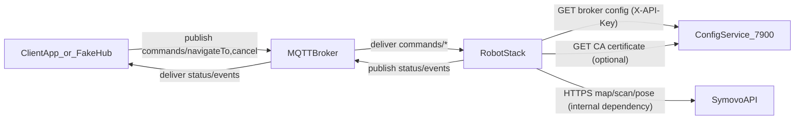
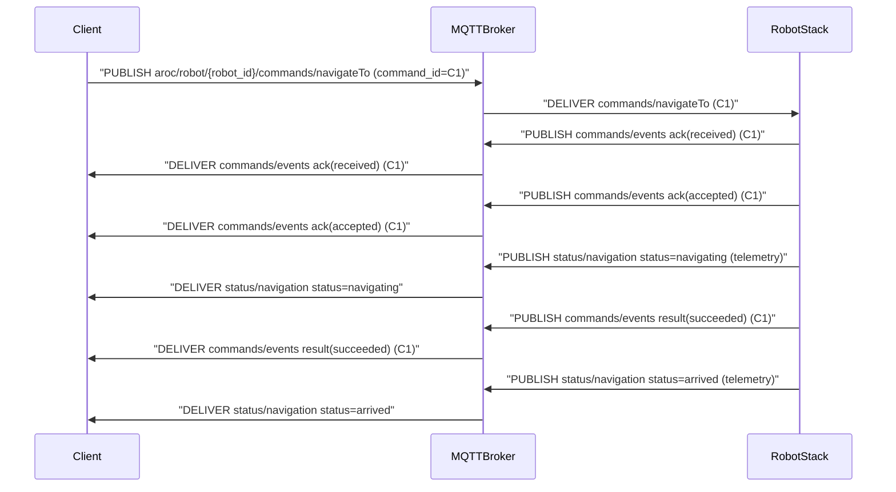
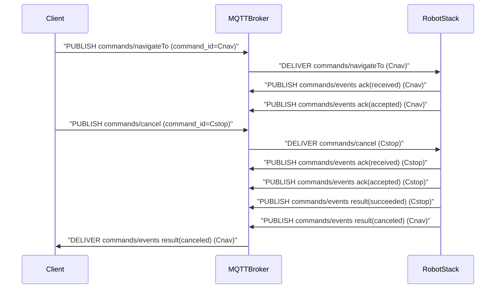
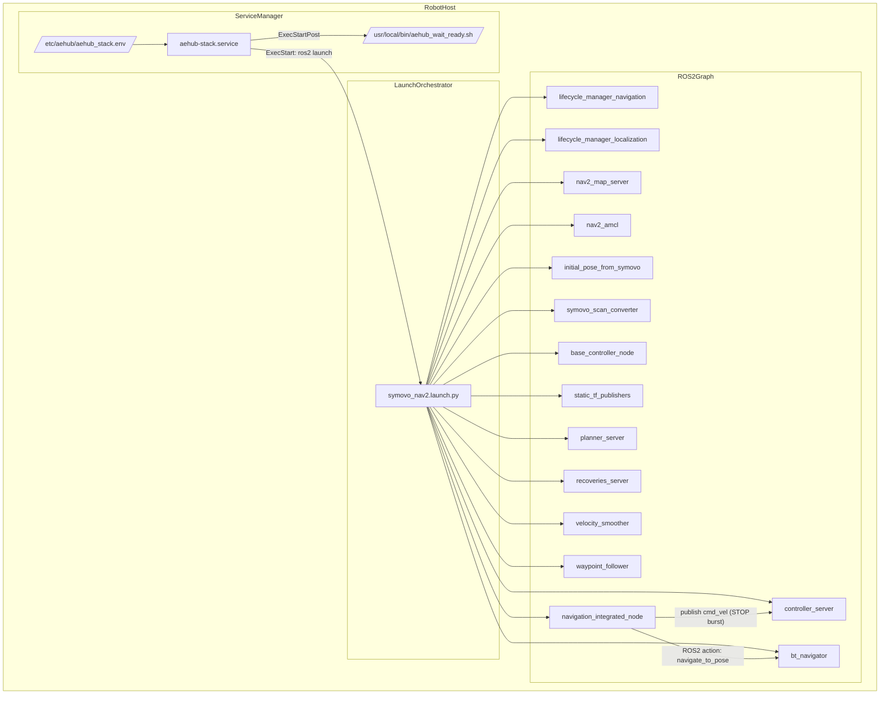

# AE.HUB Navigation System — Canonical Specification v2.0 (Robot-side)

## 0. Цель и область

**Цель:** обеспечить автономную навигацию робота по командам, приходящим через MQTT, с корректной остановкой по `cancel`, и с устойчивой работой без доступа к консоли.

**Scope (E2E):**
- ClientApp/FakeHub → MQTT Broker → RobotStack (ROS2 + Nav2 + drivers/bridges)
- RobotStack → MQTT Broker → ClientApp/FakeHub
- RobotStack → ConfigService (HTTP)
- RobotStack → Symovo API (опционально, внутренняя зависимость)

**Out of scope (но учитываем в дизайне):**
- Аппаратный safety E-stop/PLC. В этой версии `cancel` — **операционный STOP**, не safety-контур.

### 0.1 System intent / Модель мира (RU+EN)

Этот раздел фиксирует **значения терминов и смыслов**. Он нужен, чтобы будущие агенты не “додумывали” отсутствующие концепции.

- **Command / Команда**: одно входящее MQTT сообщение на `commands/*`, которое инициирует действие RobotStack. Команда идентифицируется `command_id`.
  **Команда** — это *не* “задача” в бизнес-смысле и *не* “цель” Nav2. Это единица протокола MQTT.
- **Target / Цель (`target_id`)**: логический идентификатор точки, известной RobotStack (обычно через `PositionRegistry`).
  **Target** может не совпадать с Nav2 goal id; он отражает “куда ехать” в терминах клиента.
- **STOP / Останов (`cancel`)**: операционная остановка, требующая немедленного прекращения движения и отмены активного Nav2 goal (best-effort).
  STOP *не равен* safety E-stop.
- **Authoritative events / Авторитетные события**: `commands/events` — единственный источник истины о судьбе команды.
  Клиенты интерпретируют результат **по events**, а не по telemetry.
- **Telemetry status / Телеметрия**: `status/navigation` — снимок состояния навигации для UI/мониторинга; может быть задержанным и не является “вердиктом” по команде.
### 0.2 Non-goals / Не-цели (чтобы не галлюцинировать)

- **Safety**: гарантии функциональной безопасности (E-stop, safety PLC, SIL) вне scope.
  `cancel` — это операционный STOP по сети, без safety-гарантий.
- **Exactly-once delivery**: QoS=1 MQTT не гарантирует exactly-once end-to-end; контракт компенсирует это `command_id` и идемпотентностью.
- **UI semantics**: клиентские трактовки “успешно/неуспешно” UI не часть robot-side контракта.
### 0.3 Glossary / Глоссарий (RU ↔ EN)

| Term (EN) | Термин (RU) | Meaning / Смысл |
| --- | --- | --- |
| `robot_id` | идентификатор робота | Стабильный идентификатор в MQTT topic и payload; robot-side валидирует соответствие. |
| `schema_version` | версия схемы | Строка `MAJOR.MINOR`; RobotStack принимает только MAJOR=2 (см. совместимость ниже). |
| `command_id` | идентификатор команды | UUID команды; ключ корреляции и идемпотентности. |
| `target_id` | идентификатор цели | Логическое имя точки назначения в RobotStack (PositionRegistry). |
| `active_target_id` | активная цель | Телеметрическое поле: какая цель сейчас выполняется (если есть). |
| `active_command_id` | активная команда | Телеметрическое поле: какая команда сейчас выполняется (если есть). |
| ACK | подтверждение (ack) | Набор событий `ack_status` для команды: received/accepted/rejected. |
| RESULT | результат (result) | Терминальное событие `result_status` для команды: succeeded/aborted/canceled/error. |
| authoritative | авторитетный | Истина для клиентов (в нашем протоколе: `commands/events`). |
| telemetry | телеметрия | Снимок/мониторинг (в нашем протоколе: `status/navigation`). |
| fail-closed TLS | закрыто по умолчанию | При отсутствии CA/валидного TLS RobotStack не подключается (если включено). |

### 0.4 L0 Context (C4-ish) / Контекстная схема (end-to-end)



**Stable contract / Стабильный контракт (не ломаем без MAJOR):**
- MQTT topics и payload schemas из раздела 1.
- HTTP интерфейсы ConfigService из раздела 1.3.
**Internal / Внутренности (можно менять без ломания клиентов):**
- ROS2 graph (launch, конкретные ноды), Nav2 параметры/BT, Symovo bridge реализация.

### 0.5 Repo map / Где смотреть (for future agents)

Этот список помогает быстро ориентироваться в репозитории и не “искать канон в коде”.

- **Canonical contract**: `SPECIFICATION.md`
- **Robot launch (runtime)**: `src/aehub_navigation/launch/symovo_nav2.launch.py`
- **Systemd (deployment config)**:
  - unit: `/etc/systemd/system/aehub-stack.service` (вне git)
  - env: `/etc/aehub/aehub_stack.env` (вне git)
- **MQTTBridge**: `src/aehub_navigation/src/aehub_navigation/navigation_integrated_node.py`
- **MQTT events/status serialization**:
  - `src/aehub_navigation/src/aehub_navigation/mqtt_command_event_publisher.py`
  - `src/aehub_navigation/src/aehub_navigation/mqtt_status_publisher.py`
- **Config/MQTT connectivity**:
  - `src/aehub_navigation/src/aehub_navigation/broker_config_provider.py`
  - `src/aehub_navigation/src/aehub_navigation/mqtt_connection_manager.py`
- **Client simulator / tools**:
  - `scripts/fake_hub.py`
  - `scripts/send_navigation_command.py`
---

## 1. Канонические контракты (Stable Interfaces)

### 1.1 MQTT Topics (минимум для навигации)

Все сообщения QoS=1, retain=false.

| Direction    | Topic                                       | Назначение                                      | Owner             |
| ------------ | ------------------------------------------- | ----------------------------------------------- | ----------------- |
| Client→Robot | `aroc/robot/{robot_id}/commands/navigateTo` | старт навигации                                 | ClientApp/FakeHub |
| Client→Robot | `aroc/robot/{robot_id}/commands/cancel`     | **STOP**: остановка + отмена активной навигации | ClientApp/FakeHub |
| Robot→Client | `aroc/robot/{robot_id}/commands/events`     | **authoritative** ack/result по `command_id`    | RobotStack        |
| Robot→Client | `aroc/robot/{robot_id}/status/navigation`   | telemetry состояния навигации                   | RobotStack        |

**Правило истины:**
- Решение “что случилось с командой” берётся **только** из `commands/events`.
- `status/navigation` — телеметрия, может запаздывать/быть noisy.

---

### 1.2 Payload schemas

#### 1.2.1 Общие требования к JSON
- `schema_version`: строка `MAJOR.MINOR` (пример: `"2.0"`).
- **Совместимость:** RobotStack принимает сообщения только с тем же `MAJOR`. `MINOR` может быть >= текущего (неизвестные поля игнорируются).
- Неизвестные поля JSON должны **игнорироваться** (forward compatible).

#### 1.2.2 `navigateTo` (command)

Обязательные поля:
- `schema_version`, `robot_id`, `command_id`, `timestamp`, `target_id`, `priority`

Рекомендуемые поля (optional):
- `client_id`, `ttl_seconds` (если не задан — используется дефолт робота)

#### 1.2.3 `cancel` (command) — STOP

Минимум (обязательные):
- `schema_version`, `robot_id`, `command_id`, `timestamp`

Optional:
- `reason`, `task_id`

**Семантика:** `cancel` всегда трактуется как **операционный STOP**:
- немедленная остановка базы (см. раздел STOP);
- параллельная отмена активного Nav2 goal, если активен.

#### 1.2.4 `commands/events` (authoritative)

Единый поток событий по всем командам.

События:
- **ACK(received)** — сразу при приёме и успешном парсинге JSON
- **ACK(accepted|rejected)** — после валидации и принятия к исполнению/отказа
- **RESULT(succeeded|aborted|canceled|error)** — терминальный результат, **ровно один раз** на `command_id`

Минимальные поля event:
- `schema_version`, `robot_id`, `command_id`, `timestamp`
- `event_type`: `ack` или `result`
- для ack: `ack_status`: `received|accepted|rejected`
- для result: `result_status`: `succeeded|aborted|canceled|error`
- `error_code`, `error_message` (optional, при rejected/error/aborted)

#### 1.2.5 `status/navigation` (telemetry)

Публикуется периодически с частотой `status_publish_hz`.

Минимальные поля:
- `schema_version`, `robot_id`, `timestamp`
- `status`: публичный набор `idle|navigating|arrived|error`
- `current_position` (если доступно)
- `progress_percent`, `eta_seconds` (если применимо)
- `active_target_id` (если применимо)
- `active_command_id` (если применимо)
- `error_code`, `error_message` (если status=error)

#### 1.2.6 Golden payload examples (minimal)

Примеры ниже — **минимально валидные** payload’ы, соответствующие канону `schema_version: "2.0"`.

##### `commands/navigateTo` (minimal valid)

```json
{
  "schema_version": "2.0",
  "robot_id": "robot_001",
  "command_id": "550e8400-e29b-41d4-a716-446655440000",
  "timestamp": "2026-01-16T12:00:00Z",
  "target_id": "position_A",
  "priority": "normal"
}
```

##### `commands/cancel` (minimal valid)

```json
{
  "schema_version": "2.0",
  "robot_id": "robot_001",
  "command_id": "550e8400-e29b-41d4-a716-446655440100",
  "timestamp": "2026-01-16T12:00:05Z"
}
```

##### `commands/events` — ACK (minimal valid)

```json
{
  "schema_version": "2.0",
  "robot_id": "robot_001",
  "timestamp": "2026-01-16T12:00:00Z",
  "event_type": "ack",
  "ack_status": "received",
  "command_id": "550e8400-e29b-41d4-a716-446655440000"
}
```

##### `commands/events` — RESULT (minimal valid)

```json
{
  "schema_version": "2.0",
  "robot_id": "robot_001",
  "timestamp": "2026-01-16T12:00:10Z",
  "event_type": "result",
  "result_status": "succeeded",
  "command_id": "550e8400-e29b-41d4-a716-446655440000"
}
```

##### `status/navigation` (minimal valid)

```json
{
  "schema_version": "2.0",
  "robot_id": "robot_001",
  "timestamp": "2026-01-16T12:00:01Z",
  "status": "navigating"
}
```

#### 1.2.7 Golden event sequences (Mermaid)

##### NavigateTo success (happy path)



##### Cancel during active navigate (STOP)



---

### 1.3 ConfigService HTTP API

RobotStack читает конфиг брокера и CA.

**Broker config:**
- `GET /api/v1/config/broker?include_password=true`
- Header: `X-API-Key: <API_KEY>`
- Ошибки: `401`, `429`, `5xx`

**CA certificate:**
- `GET /api/v1/config/certificates/ca`
- Политика auth: допускается без ключа, но RobotStack должен поддержать и вариант с key (конфигурируемо).

---

### 1.4 L0 Blocks (RU/EN) — responsibilities, interfaces, failure modes

Цель этого раздела — дать будущим агентам “полную картину” по блокам и **не оставить места для додумывания**.

#### 1.4.1 `ClientApp/FakeHub` (External client)

- **Purpose / Назначение**: отправлять команды навигации и STOP, отображать результат и состояние робота.
- **Responsibilities / Ответственность**:
  - формировать команды `navigateTo`/`cancel` согласно схеме
  - генерировать уникальный `command_id` (UUID) и сохранять корреляцию
  - принимать `commands/events` и строить пользовательский вердикт
  - использовать `status/navigation` только как телеметрию
- **Inputs/Outputs / Интерфейсы**:
  - **publish**: `.../commands/navigateTo`, `.../commands/cancel` (QoS=1, retain=false)
  - **subscribe**: `.../commands/events`, `.../status/navigation` (QoS=1, retain=false)
- **State model / Состояния (клиентские)**:
  - `awaiting_ack_received` → `awaiting_ack_accepted_or_rejected` → `awaiting_result` → `terminal`
- **Timing / Тайминги**:
  - client-side timeout ожидания `ack(received)` и `result(...)` задаётся клиентом
- **Failure modes / Отказы**:
  - не получил `result` → считать “unknown” и предлагать повтор/диагностику
  - получил `ack(rejected)` + `result(error)` → вывести причину (`error_code/message`)
- **Observability / Наблюдаемость**:
  - клиент логирует опубликованные `command_id` и timeline событий
- **Contract vs Internals**:
  - **Contract**: темы MQTT и поля payload
  - **Internals**: UI/UX и бизнес-логика интерпретации
#### 1.4.2 `MQTT Broker` (Transport)

- **Purpose / Назначение**: доставка сообщений между ClientApp и RobotStack.
- **Responsibilities / Ответственность**:
  - гарантировать доставку QoS=1 “at least once”
  - обеспечивать ACL/аутентификацию (по политике деплоя)
- **Inputs/Outputs / Интерфейсы**:
  - MQTT v3.1.1/5.0 (зависит от брокера; RobotStack использует paho MQTT v3.1.1)
- **State model / Состояния**:
  - broker-side состояния не нормируются этим документом
- **Timing / Тайминги**:
  - keepalive/timeout задаётся клиентами; broker должен выдерживать reconnect storm (см. backoff на robot-side)
- **Failure modes / Отказы**:
  - broker недоступен → RobotStack уходит в reconnect/backoff, клиент не получает ответы
- **Observability / Наблюдаемость**:
  - рекомендуется иметь broker logs/metrics: connections, auth failures, dropped packets
- **Contract vs Internals**:
  - **Contract**: темы и QoS политики, retain=false
  - **Internals**: конкретный брокер/кластеризация
#### 1.4.3 `ConfigService` (HTTP configuration authority)

- **Purpose / Назначение**: единый источник конфигурации MQTT broker и (опционально) CA.
- **Responsibilities / Ответственность**:
  - выдавать актуальные broker параметры для RobotStack
  - защищать доступ `X-API-Key` (как минимум для broker config)
- **Inputs/Outputs / Интерфейсы**:
  - `GET /api/v1/config/broker?include_password=true` + `X-API-Key`
  - `GET /api/v1/config/certificates/ca` (+/- `X-API-Key`)
- **State model / Состояния**:
  - сервис хранит конфиг; robot-side не полагается на “push”, только polling/refresh
- **Timing / Тайминги**:
  - robot-side использует retry/backoff; ConfigService должен быть готов к периодическим запросам
- **Failure modes / Отказы**:
  - `401` → неправильный ключ; robot-side не сможет подключиться к MQTT
  - `429/5xx` → временная недоступность; robot-side должен уйти в backoff
- **Observability / Наблюдаемость**:
  - желательно логировать выдачу конфигов, 401/429, latency
- **Contract vs Internals**:
  - **Contract**: URL/endpoint’ы и семантика кодов ответа
  - **Internals**: storage/база/кеширование
#### 1.4.4 `RobotStack` (Robot-side navigation service)

- **Purpose / Назначение**: принять команды по MQTT, исполнить навигацию через ROS2/Nav2, опубликовать authoritative events и телеметрию.
- **Responsibilities / Ответственность**:
  - обеспечить ordering и exactly-one terminal `result` per `command_id`
  - обеспечить STOP semantics по `cancel`
  - reconnect/resubscribe и автономность (без консоли)
  - публиковать `status/navigation` периодически
- **Inputs/Outputs / Интерфейсы**:
  - MQTT (раздел 1.1–1.2)
  - ConfigService HTTP (раздел 1.3)
  - ROS2/Nav2 (internal): action `navigate_to_pose`, topics `/cmd_vel`, `/tf` и др.
- **State model / Состояния**:
  - robot-side состояния см. раздел 4
- **Timing / Тайминги**:
  - `status_publish_hz`, `command_process_hz`
  - backoff reconnect/config fetch
- **Failure modes / Отказы**:
  - при потере MQTT: не принимает новые команды
  - при недоступном Nav2: отвергает `navigateTo` с `NAV_SERVER_UNAVAILABLE`
- **Observability / Наблюдаемость**:
  - по MQTT видны события и статус; в логах — причины reject/error
- **Contract vs Internals**:
  - **Contract**: MQTT+ConfigService, semantics STOP, event ordering
  - **Internals**: ROS2 ноды/launch/Nav2 настройки/алгоритмы
#### 1.4.5 `Symovo API` (External robot data provider; internal dependency)

- **Purpose / Назначение**: источник данных карты/позы/скана для robot-side (если включено).
- **Responsibilities / Ответственность**:
  - отдавать данные с приемлемой доступностью/latency
- **Inputs/Outputs / Интерфейсы**:
  - HTTPS endpoints Symovo (версия/детали Symovo не являются stable contract для MQTT клиентов)
- **State model / Состояния**:
  - не нормируется этим документом
- **Timing / Тайминги**:
  - timeouts должны быть ограничены, чтобы не блокировать основной цикл RobotStack
- **Failure modes / Отказы**:
  - Symovo down/timeout → деградация Nav2 readiness и/или reject navigateTo (см. 6.2 D)
- **Observability / Наблюдаемость**:
  - robot-side логирует таймауты/ошибки соединения с Symovo
- **Contract vs Internals**:
  - **Contract**: нет (Symovo — внутренняя зависимость RobotStack)
  - **Internals**: endpoints, конвертеры scan/pose
---

## L1 Robot-side (mandatory): systemd → launch → ROS2 graph → MQTTBridge

Этот раздел обязателен в каноне: он фиксирует **как именно** robot-side поднимается и какие ROS2 компоненты считаются критичными.

### L1.1 Diagram (C4-ish, robot host)



### L1.2 Canonical runtime entrypoints / Каноничные точки входа

- **Systemd unit**: `aehub-stack.service` (вне git; отвечает за автозапуск/рестарты).
- **Launch file (runtime)**: `src/aehub_navigation/launch/symovo_nav2.launch.py`.
- **MQTTBridge**: `src/aehub_navigation/src/aehub_navigation/navigation_integrated_node.py`.
### L1.3 Required vs Optional (для readiness и DoD)

#### Required (должны работать для навигации по MQTT)
- **ServiceManager**: systemd unit должен запускаться и рестартить процесс.
- **LaunchOrchestrator**: должен поднять ROS2 graph.
- **Nav2 core**: `bt_navigator`, `controller_server`, `planner_server`, lifecycle managers.
- **TF/odometry minimum**: наличие `/tf`/`/tf_static` и базового движения (через `/cmd_vel`).
- **MQTTBridge**: подписки на `commands/*`, публикация `commands/events` и `status/navigation`.
#### Optional (могут быть выключены, но влияют на качество/готовность)
- **Symovo integration**: `symovo_scan_converter`, `initial_pose_from_symovo`, автозагрузка карты.
  При недоступном Symovo возможны деградации (см. раздел 6.2 D).
### L1.4 ROS2 contract (key nodes/topics/actions/TF)

#### Action (Nav2)
- **`navigate_to_pose`**: RobotStack отправляет goal и получает result.
#### Topics (минимум)
- **`/cmd_vel`**: используется для STOP burst (publish нулевых скоростей).
- **`/tf`, `/tf_static`**: трансформации (Nav2/AMCL/costmaps).
- **`/odom`**: одометрия (источник зависит от драйвера/контроллера).
#### TF invariants (критично)
- Должна существовать трансформация между base frame и scan frame.
  Пример: `base_link -> laser` (часто публикуется как static TF).
- Симптомы отсутствия TF: drop сообщений `/scan` в costmaps/AMCL, отсутствие корректного map→odom, `bt_navigator` остаётся inactive и цели отклоняются.

#### Key nodes (Nav2 core; ориентир для агентов)

- `lifecycle_manager_localization`, `lifecycle_manager_navigation`: управляют lifecycle состояниями Nav2 нод.
- `nav2_map_server`, `nav2_amcl`: карта и локализация (если используется AMCL).
- `planner_server`, `controller_server`: построение пути и управление базой.
- `bt_navigator`: принимает action `navigate_to_pose`, исполняет BT и отдаёт result.
- `recoveries_server`, `velocity_smoother`, `waypoint_follower`: восстановление/сглаживание/маршруты (по конфигу).

### L1.5 Block-by-block (mandatory)

#### L1.5.1 `ServiceManager` (systemd + env)

- **Purpose / Назначение**: автозапуск стека и рестарты без консоли.
- **Interfaces / Интерфейсы**:
  - unit: `aehub-stack.service`
  - env: `/etc/aehub/aehub_stack.env`
  - logs: `journalctl -u aehub-stack.service`
- **State model / Состояния**:
  - `inactive` → `activating` → `active` или `failed` (systemd semantics)
- **Timing / Тайминги**:
  - `Restart=always` (ожидается), `RestartSec` малый
  - `TimeoutStartSec` должен покрывать холодный старт Nav2
- **Failure modes / Отказы**:
  - неверные env (например API key) → нет MQTT
  - падение процесса → systemd рестартит

#### L1.5.2 `ReadinessProbe` (`aehub_wait_ready.sh`)

- **Purpose / Назначение**: gate “готов к навигации”.
- **Interfaces / Интерфейсы**:
  - читает ROS2 graph через `ros2 node list`, `ros2 action list`, `ros2 topic list`
  - возвращает exit code 0/1 для systemd `ExecStartPost`
- **Readiness criteria / Критерии готовности (минимум)**:
  - есть Nav2 ноды (planner/controller/bt_navigator)
  - есть action `navigate_to_pose`
  - есть базовые TF/odom темы (`/tf` или `/tf_static` или `/odom`)
- **Operational note**:
  - при проблемах `ros2 daemon` используйте `ros2 node list --no-daemon` для диагностики

#### L1.5.3 `LaunchOrchestrator` (`symovo_nav2.launch.py`)

- **Purpose / Назначение**: поднять ROS2 graph в правильном порядке.
- **Key behaviors / Ключевые поведения**:
  - защита от двойного запуска (stack lock; обычно `/tmp/symovo_nav2_stack.lock`)
  - загрузка карты (если включено) и подготовка параметров
  - запуск `navigation_integrated_node` (MQTTBridge)
- **Interfaces / Интерфейсы**:
  - launch args: `robot_id`, `config_service_url`, `config_service_api_key`, `symovo_endpoint`, `amr_id`, `params_file` и др.
  - публикация статических TF (например base↔laser) может быть частью launch
- **Failure modes / Отказы**:
  - lock already held → стек считается уже запущенным
  - map/symovo проблемы → деградация навигации (см. раздел 6.2 D)

#### L1.5.4 `ROS2Graph` (required components)

- **Purpose / Назначение**: обеспечить Nav2 navigation pipeline и связь с базой/сенсорами.
- **Contract / Контракт (минимум)**:
  - action `navigate_to_pose` доступен
  - `/cmd_vel` принимается контроллером
  - TF цепочка позволяет Nav2 использовать sensor data (особенно scan frame)
- **Observability / Наблюдаемость**:
  - `ros2 node list --no-daemon`
  - `ros2 action list`
  - `ros2 topic echo /tf_static` (выборочно)

#### L1.5.5 `MQTTBridge` (`navigation_integrated_node`)

- **Purpose / Назначение**: bridge между MQTT контрактом и Nav2 action.
- **Internal pipeline / Внутренний конвейер**:
  - subscribe `commands/navigateTo`, `commands/cancel`
  - parse → `ack(received)`
  - validate (`schema_version`, `robot_id`, required fields)
  - rate limit (только navigateTo)
  - dispatch: send goal / stop burst + cancel goal
  - publish `commands/events` (ack/result) и `status/navigation` (telemetry)
- **Hard contract / Жёсткие гарантии**:
  - ordering `ack(received)` → `ack(accepted|rejected)` → terminal `result`
  - terminal `result` ровно один раз на `command_id`
  - `cancel` всегда best-effort обрабатывается
---

## 2. Одна точка запуска и автономная эксплуатация

### 2.1 Единственная точка запуска

На роботе существует **один** запускаемый unit:
- systemd unit: `aehub-stack.service`
- `ExecStart`: `ros2 launch aehub_navigation symovo_nav2.launch.py ...`
- env: `/etc/aehub/aehub_stack.env`

**Требование:** после загрузки ОС стек поднимается автоматически и входит в состояние `READY_FOR_COMMANDS` без участия оператора.

---

## 3. Robot-side архитектура (внутренности могут меняться)

### 3.1 Компоненты (минимум)

* `navigation_integrated_node` (MQTTBridge)
  - `MQTTConnectionManager` (TLS, reconnect, resubscribe)
  - `BrokerConfigClient` (ConfigService)
  - `CommandQueue` (thread-safe)
  - `CommandProcessor` (ROS timer loop)
  - `CommandValidator` (schema/robot_id/required fields)
  - `CommandRateLimiter` (для navigateTo; cancel не блокируется)
  - `NavigationActionClient` (Nav2 NavigateToPose)
  - `Stopper` (cmd_vel zero burst + cancel goal)
  - `NavigationStateManager` (state machine + telemetry shaping)
  - `MQTTStatusPublisher` (`status/navigation`)
  - `MQTTCommandEventPublisher` (`commands/events`)

* ROS2 stack: Nav2 + базовый контроллер + локализация/scan/TF (как в launch)

---

## 4. Состояния и инварианты (robot-side)

### 4.1 Внутренние состояния `navigation_integrated_node`

Рекомендуемая state machine:
- `BOOT`
- `FETCHING_CONFIG`
- `MQTT_CONNECTING`
- `WAITING_ROS_READY` (Nav2 action available + минимум TF/pose)
- `READY` (принимаем команды)
- `EXECUTING` (активная navigateTo)
- `STOPPING` (обработка cancel)
- `ERROR` (деградация, но процесс жив)

**Инварианты:**
1. `cancel` обрабатывается **всегда**, даже если `READY` не достигнут (best-effort stop).
2. Для любого `command_id`:
   - `ack(received)` ≤ `ack(accepted|rejected)` ≤ `result(...)`
   - `result` публикуется **ровно один раз**.
3. В `READY/EXECUTING` RobotStack публикует `status/navigation` периодически.
4. Если MQTT connection lost:
   - RobotStack продолжает работать локально, но команды не принимает.
   - При восстановлении соединения resubscribe выполняется автоматически.

### 4.2 E2E invariants (RU/EN) — protocol guarantees

#### 4.2.1 Event ordering and terminality / Порядок и терминальность событий

Для каждого `command_id` RobotStack обязан обеспечить:
- **ACK(received)** публикуется как можно раньше после парсинга JSON.
- **ACK(accepted|rejected)** публикуется после валидации и решения об исполнении.
- **RESULT(...)** публикуется **ровно один раз** и является терминальным.
Клиентская логика должна опираться на следующие правила:
- **Source of truth / Истина**: итог команды берётся из `commands/events`.
- `status/navigation` не может “переписать” терминальный result.
#### 4.2.2 Idempotency / Идемпотентность и дубликаты

MQTT QoS=1 допускает дубликаты сообщений. Контракт компенсирует это так:
- **Client requirement**: клиент обязан генерировать новый UUID `command_id` для каждой новой команды.
- **RobotStack requirement**: если robot-side получает повтор команды с тем же `command_id`, он должен:
  - не выполнять действие повторно
  - **воспроизвести** (replay) ранее опубликованные `ack_status` и терминальный `result_status` для этого `command_id`, если они известны
Примечание: детали внутреннего кеша (TTL, размер) являются **internals**, но поведение “не выполнять повторно + replay outcome” является **contract**.

#### 4.2.3 STOP semantics / Семантика STOP (cancel)

- `cancel` трактуется как **операционный STOP**.
- `cancel` не блокируется rate limiter'ом.
- `cancel` имеет собственный `command_id` и получает собственные `ack` и `result`.
- Если есть активный `navigateTo`, robot-side обязан в итоге опубликовать для него терминальный `result_status=canceled` (или `error` при невозможности отмены по таймауту).
#### 4.2.4 Schema versioning / Версионирование схем (MAJOR.MINOR)

**Правило:** RobotStack принимает только сообщения с `schema_version` где `MAJOR=2`.

**Backward-compatible changes (MINOR bump allowed):**
- Добавление новых optional полей в payload.
- Добавление новых значений enum **только** если клиенты обязаны игнорировать неизвестное (рекомендуется избегать для `status`, допускается для расширенных полей).
- Уточнение документации без изменения смысла.

**Breaking changes (MAJOR bump required):**
- Переименование/удаление полей.
- Изменение типа поля.
- Изменение обязательности (optional → required).
- Изменение semantics STOP/event ordering.
- Изменение meaning существующих enum значений.
---

## 5. STOP (cancel) — нормативное поведение

### 5.1 Семантика cancel=STOP

При получении `commands/cancel` RobotStack обязан:
1. Сразу опубликовать:
   - `events: ack(received)`
2. После валидации:
   - `events: ack(accepted)` (или `rejected` если schema/robot_id не совпали)
3. Запустить STOP-процедуру:
   - **A.** `Stopper`: publish `/cmd_vel = 0` burst
     - частота: 10–20 Hz
     - длительность: 1–2 сек (параметризуемо)
   - **B.** Параллельно: cancel активного Nav2 goal (если есть)
4. Завершить cancel-команду:
   - `events: result(succeeded)` для cancel `command_id`
5. Если был активный navigateTo:
   - опубликовать `result(canceled)` по navigateTo `command_id` **когда** придёт подтверждение от action server (или по таймауту отмены → `error`)

**Примечание:** `cancel` — операционный stop. Safety-остановка не гарантируется через сеть.

---

## 6. Поведение при отказах и самовосстановление

### 6.1 Уровни восстановления
**Уровень 0 (внутри узла):** retry/backoff, reconnect, resubscribe, переход в ERROR без падения процесса.  
**Уровень 1 (ROS2 lifecycle):** Nav2 lifecycle manager перезапускает свои lifecycle-ноды по контракту Nav2.  
**Уровень 2 (systemd):** если процесс падает — systemd перезапускает сервис.

### 6.2 Сценарии отказов и обязательная реакция

#### A) ConfigService недоступен / 401 / 429
- RobotStack не может получить broker config → не подключается к MQTT.
- Должен:
  - логировать причину и код (`401`, `429`, `5xx`)
  - переходить в `FETCHING_CONFIG` с экспоненциальным backoff
  - публиковать локально (в журнал) “DEGRADED: NO_MQTT”
- Опционально: использовать “last known good config” (если включено).

#### B) MQTT broker down / TLS fail / auth fail
- Должен:
  - automatic reconnect с backoff
  - после reconnect: resubscribe
  - не “флапать” процессом (не падать)

#### C) Nav2 action server недоступен
- На `navigateTo`:
  - `ack(received)` → `ack(rejected)` → `result(error)` с `NAV_SERVER_UNAVAILABLE`
- `cancel`:
  - всё равно сделать STOP burst и вернуть `result(succeeded)` для cancel.

#### D) Symovo недоступен (scan/pose)
- Это влияет на Nav2 readiness/качество, но RobotStack должен:
  - чётко репортить `status/navigation = error` (если навигация невозможна)
  - reject `navigateTo` с `LOCALIZATION_OR_SENSOR_UNAVAILABLE` (или аналог)
  - `cancel` остаётся доступным.

#### E) Падение отдельных ROS2 нод
- Если Nav2 падает и не восстанавливается lifecycle:
  - `navigateTo` начинает отвергаться (как выше)
  - `status/navigation` публикует `error`
- Если весь launch процесс падает:
  - systemd рестартит сервис.

---

## 7. Наблюдаемость без консоли

### 7.1 Обязательные сигналы наружу (через MQTT)
- `commands/events` — для любой команды
- `status/navigation` — периодически

### 7.2 Логи
Требование: все критичные события должны быть отражены в логах процесса (journal):
- startup steps (config fetched, mqtt connected, nav2 ready)
- переходы state machine
- причины reject/error с кодами

### 7.3 Метрики (минимум в статусе или logs)
- `mqtt_connected` (bool)
- `nav2_available` (bool)
- `last_command_timestamp`
- `active_command_id/target_id`
- `reconnect_count`
- `config_fetch_last_status_code`

---

## 7A. Runbook / Operational checks (mandatory)

Этот раздел нормативный: по нему оператор/агент должен уметь понять “что сломалось” без ручной магии.

### 7A.1 systemd (startup / restarts)

- **Status**: `systemctl status aehub-stack.service`
- **Logs**: `journalctl -u aehub-stack.service -f`
- **Restart (manual)**: `sudo systemctl restart aehub-stack.service`

### 7A.2 ROS2 readiness (graph / action / topics)

- **Node list**: `ros2 node list --no-daemon`
  (Если без `--no-daemon` список пустой — возможна проблема `ros2 daemon`/environment.)
- **Action list**: `ros2 action list --no-daemon`
  Ожидается `navigate_to_pose`.
- **Topic list**: `ros2 topic list --no-daemon`
  Ожидаются `/cmd_vel`, `/tf`/`/tf_static`, `/odom` (зависит от конфигурации).

### 7A.3 MQTT quick check (contract sanity)

- **Subscribe**:
  - `aroc/robot/{robot_id}/commands/events`
  - `aroc/robot/{robot_id}/status/navigation`
- **Publish**:
  - `aroc/robot/{robot_id}/commands/navigateTo`
  - `aroc/robot/{robot_id}/commands/cancel`
- **Expected**:
  - на любую команду должен прийти `ack(received)` и далее `ack(accepted|rejected)`
  - затем terminal `result_status` (ровно один раз на `command_id`)

### 7A.4 Common symptoms → likely cause → action

- **No MQTT connection (robot never publishes status/events)**:
  - **likely**: ConfigService `401` (неверный API key) или broker down/TLS
  - **action**: проверить `config_service_url` и `config_service_api_key` в env, проверить доступность ConfigService
- **Readiness hangs (service active but not ready)**:
  - **likely**: `ros2 daemon`/domain mismatch или Nav2/TF не поднялись
  - **action**: `ros2 node list --no-daemon`, `ros2 action list --no-daemon`, смотреть TF
- **ack(received) but rejected**:
  - **likely**: `schema_version` MAJOR != 2, `robot_id` mismatch, missing required fields
  - **action**: сравнить payload с разделом 1.2
- **ack(accepted) but no terminal result**:
  - **likely**: Nav2 action server завис/недоступен или goal не завершает result
  - **action**: проверить наличие action, логи `bt_navigator`, состояние lifecycle
- **Navigation aborts / TF errors / scan drops**:
  - **likely**: отсутствует TF base↔laser или проблемы локализации
  - **action**: проверить `/tf_static`, согласованность frame_id у scan и base
## 8. Тайминги и параметры (конфигурируемые)

Рекомендуемые параметры (в env/launch):
- `status_publish_hz` (default: 2)
- `command_process_hz` (default: 20)
- `navigate_rate_limit_s` (default: 1.0)
- `stop_burst_hz` (default: 20)
- `stop_burst_duration_s` (default: 1.5)
- `cancel_goal_timeout_s` (default: 5)
- `config_fetch_backoff` (min/max)
- `mqtt_reconnect_backoff` (min/max)

---

## 9. Definition of Done (для реализации)

Система считается готовой, если:
1. **Boot autonomy:** после перезагрузки ОС сервис стартует и выходит в `READY` без консоли.
2. **Command protocol correctness:** для каждого `command_id` строго:
   - `ack(received)` → `ack(accepted|rejected)` → один `result(...)`.
3. **Cancel=STOP:** при `cancel` робот физически перестаёт подавать движение (cmd_vel=0 burst) и отменяет активную навигацию.
4. **Failure handling:** при падении ConfigService/MQTT/Nav2:
   - система не “умирает молча”;
   - корректно репортит `events/status`;
   - самовосстанавливается при возвращении зависимостей.
5. **No-console operability:** по MQTT events/status можно понять:
   - принял ли робот команду;
   - выполняет ли;
   - завершил ли;
   - почему отказал/упал.

---

## 10. Примечание о стратегии автономности

Nav2 lifecycle закрывает часть сценариев (lifecycle bringup, bonds, перезапуски отдельных lifecycle-нод), но полной автономии “сам всё починит” без внешней политики не гарантирует. Поэтому фиксируем трёхуровневую стратегию:
- retry/reconnect на уровне узла,
- lifecycle на уровне Nav2,
- restart на уровне systemd.

