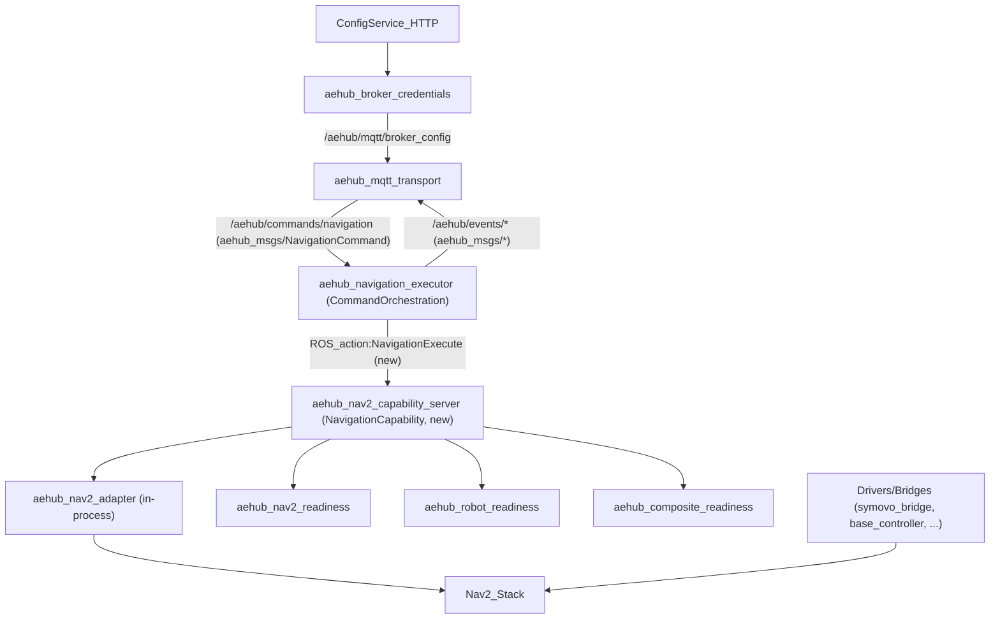

# Architecture (ROS 2 Jazzy) — HUBNavigation Stack

## Purpose

This document fixes **system architecture, responsibilities, and ownership boundaries** for HUBnavigation stack on ROS 2 Jazzy.

Primary goals:
- Eliminate “ROS monolith” responsibility mixing.
- Make interfaces explicit and testable.
- Guarantee safety-critical ownership rules (STOP, `/cmd_vel`, Nav2 lifecycle).

Non-goals:
- Implement refactors in code (this doc is the contract).
- Define robot-specific driver details beyond ownership boundaries.

## Canon (reference implementations)

The following packages are treated as architectural canon (responsibility boundaries are correct and must not be violated):

- `src/aehub_broker_credentials/`
  - Infra-only lifecycle node: HTTP → publishes `/aehub/mqtt/broker_config` (`aehub_msgs/BrokerConfig`, latched QoS).
- `src/aehub_mqtt_transport/`
  - Transport-only: MQTT ↔ ROS mapping, connection lifecycle; **no Nav2 / no HTTP / no business logic**.
- `src/aehub_nav2_readiness/`
  - Readiness as **non-node** domain service: snapshot-based, pure checks.
- `src/aehub_robot_readiness/`
  - Physical robot readiness gate.
- `src/aehub_nav2_adapter/`
  - Capability adapter (Nav2 encapsulation), **not** an orchestrator.
- `src/aehub_composite_readiness/`
  - Pure readiness aggregator (no side effects).
- `src/aehub_navigation_executor/`
  - Application-layer executor: FSM + idempotency, transport-agnostic.

## As-is (current problems)

The real architectural violations exist in:

- `src/aehub_navigation/`
  - A mixed-responsibility node (`navigation_integrated_node.py`) combining:
    - Infrastructure: HTTP config fetch, MQTT connect/reconnect
    - Application: idempotency/validation/rate-limit/state
    - Capability: Nav2 goals
    - Safety/control: STOP burst and `/cmd_vel`
    - Robot/vendor decisions: Symovo readiness checks
- `scripts/robot_bridge.py`
  - Another mixed monolith duplicating contracts and Nav2 control logic.

Resulting risks:
- duplicated (and diverging) command/event contracts
- multiple potential owners of STOP and `/cmd_vel` (race conditions, phantom stops)
- inconsistent idempotency and FSM semantics
- hard to test pieces in isolation

**Decision:** these monoliths are **legacy** and must be deprecated, not “fixed in place”.

## To-be (target architecture)

### Layer naming

- **Infrastructure layer**: HTTP config, MQTT transport.
- **Command Orchestration Layer (Application layer)**: NavigationExecutor (FSM/idempotency/policy), no hardware side effects.
- **Navigation Capability (Capability layer)**: single owner of Nav2 + readiness + STOP.
- **Drivers/Bridges**: robot/vendor integration; no business decisions.

### Ownership / authority (HARD invariants)

These are non-negotiable:

- **`/cmd_vel` publishing**
  - Only **Navigation Capability** (or a driver under its authority) may publish `/cmd_vel`.
  - Command Orchestration **MUST NEVER** publish `/cmd_vel` under any conditions.
- **STOP semantics (stop burst)**
  - Implemented only inside **Navigation Capability**.
  - Orchestration may only request cancellation via the formal interface.
- **Nav2 lifecycle ownership**
  - Configure/activate/deactivate/cancel/recovery flows are owned exclusively by **Navigation Capability** (in-process via `aehub_nav2_adapter`).
- **Readiness gates**
  - Called and aggregated only in **Navigation Capability**.
  - Orchestration never “helps” readiness or queries gates directly.

### Component diagram (to-be)

## Package → layer → responsibility → public ROS API (no tables)

- **`aehub_broker_credentials` (Infrastructure)**
  - **Responsibility**: fetch broker config from HTTP, validate, publish broker config to ROS.
  - **ROS API**:
    - Publishes: `/aehub/mqtt/broker_config` (`aehub_msgs/BrokerConfig`, RELIABLE + TRANSIENT_LOCAL).

- **`aehub_mqtt_transport` (Infrastructure)**
  - **Responsibility**: MQTT connection lifecycle + topic mapping between MQTT and ROS.
  - **ROS API**:
    - Subscribes: `/aehub/mqtt/broker_config` (`aehub_msgs/BrokerConfig`).
    - Publishes/Subscribes (mapping-defined): command/event topics used by higher layers.

- **`aehub_navigation_executor` (Command Orchestration)**
  - **Responsibility**: accept commands (ROS), validate + dedup + FSM, emit ack/result/state events.
  - **Hard boundaries**: no Nav2 API calls, no `/cmd_vel`, no readiness checks.
  - **ROS API (canonical)**:
    - Subscribes: `/aehub/commands/navigation` (`aehub_msgs/NavigationCommand`).
    - Publishes: `/aehub/events/command_ack` (`aehub_msgs/CommandAck`).
    - Publishes: `/aehub/events/command_result` (`aehub_msgs/CommandResult`).
    - Publishes: `/aehub/events/navigation_state` (`aehub_msgs/NavigationState`).
    - Calls: **Navigation Capability action** (new) for actual navigation execution/cancel.

- **`aehub_nav2_capability_server` (Navigation Capability, new)**
  - **Responsibility**: single owner of Nav2 + readiness + STOP. Executes navigation requests on behalf of Orchestration.
  - **Uses in-process**:
    - `aehub_nav2_adapter`
    - readiness gates: `aehub_nav2_readiness`, `aehub_robot_readiness`, `aehub_composite_readiness`
  - **ROS API (new contract)**:
    - Provides: ROS 2 Action “NavigationExecute” (name and fields defined in SRS).
    - Publishes `/cmd_vel` only if implementing STOP burst (or delegates to a driver).

- **`aehub_nav2_adapter` (Capability internal)**
  - **Responsibility**: encapsulate Nav2 NavigateToPose and lifecycle integration; deterministic events/time budgets; not orchestrating policy.
  - **ROS API**: interacts with Nav2 action server (`/navigate_to_pose`) and lifecycle nodes internally.

- **`symovo_bridge`, `base_controller` (Drivers/Bridges)**
  - **Responsibility**: pure adaptation of vendor/robot interfaces to ROS (sensors, odom, scans, etc.).
  - **Hard boundaries**: no business decisions, no orchestration, no owning STOP policy.

## Legacy / deprecation

Legacy components to be deprecated and replaced by the to-be architecture:
- `src/aehub_navigation/`
- `scripts/robot_bridge.py`

They must not be used as a baseline for new features; all new work targets the to-be architecture.

