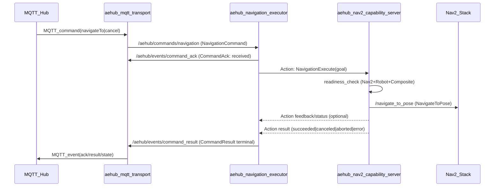

# SRS — Navigation (ROS 2 Jazzy) for AE.HUB Clean Architecture

## 1. Scope

This SRS specifies **interfaces, invariants, and responsibilities** for the navigation command pipeline:

MQTT → ROS transport → Command Orchestration (Executor) → Navigation Capability → Nav2.

This SRS is authoritative for:
- command/event contracts used across the stack
- ownership boundaries (STOP, `/cmd_vel`, readiness, Nav2 lifecycle)
- idempotency and determinism requirements

## 2. Definitions

- **Infrastructure**: broker credentials + MQTT transport.
- **Command Orchestration (Application layer)**: `aehub_navigation_executor`.
- **Navigation Capability (Capability layer)**: `aehub_nav2_capability_server` (new).
- **Nav2 Adapter**: `aehub_nav2_adapter` (in-process inside capability).
- **Readiness Gates**: `aehub_nav2_readiness`, `aehub_robot_readiness`, `aehub_composite_readiness`.

## 3. Hard invariants (MUST)

### 3.1 Ownership / authority

- **INV-OWN-01 (`/cmd_vel`)**: Command Orchestration **MUST NOT** publish `/cmd_vel` under any conditions.
- **INV-OWN-02 (STOP)**: STOP burst (zero `cmd_vel` burst) **MUST** be implemented only by Navigation Capability (or a driver under its authority).
- **INV-OWN-03 (Nav2 lifecycle)**: only Navigation Capability may own Nav2 lifecycle transitions and Nav2 cancel/recovery flows (via `aehub_nav2_adapter` in-process).
- **INV-OWN-04 (Readiness)**: readiness gates are evaluated/aggregated only inside Navigation Capability.

### 3.2 Determinism / idempotency

- **INV-IDEM-01**: For a given `command_id`, the system produces **at most one** terminal result (`succeeded|canceled|aborted|error`).
- **INV-IDEM-02**: Duplicate commands with the same `command_id` **MUST NOT** trigger a second Nav2 goal.
- **INV-IDEM-03**: Duplicate commands **MUST** replay the previously emitted ack/result (transport-agnostic replay).

### 3.3 Transport separation

- **INV-SEP-01**: Orchestration and Capability **MUST NOT** know about MQTT topics/payloads.
- **INV-SEP-02**: Infrastructure (MQTT transport) **MUST NOT** implement business logic (idempotency, validation semantics beyond mapping).

## 4. System flow (normative)

## 5. ROS interfaces — Transport ↔ Orchestration (canonical)

### 5.1 Command topic (inbound)

- **Topic**: `/aehub/commands/navigation`
- **Type**: `aehub_msgs/NavigationCommand`
- **Source**: `aehub_mqtt_transport` (mapping from MQTT)
- **Consumer**: `aehub_navigation_executor`
- **QoS**: RELIABLE, KEEP_LAST depth≥10

Message definition:
- `src/aehub_msgs/msg/NavigationCommand.msg`

Rules:
- `command_id` MUST be present and stable for idempotency.
- `type` MUST be `"navigateTo"` or `"cancel"`.
- For `navigateTo`: either `target_id` OR (`x`,`y`) MUST be provided.

### 5.2 Event topics (outbound)

These topics are transport-agnostic outputs from Orchestration. Transport maps them to MQTT.

- **Ack**
  - Topic: `/aehub/events/command_ack`
  - Type: `aehub_msgs/CommandAck`
  - Semantics: `received|accepted|rejected`

- **Result (terminal)**
  - Topic: `/aehub/events/command_result`
  - Type: `aehub_msgs/CommandResult`
  - Semantics: `succeeded|canceled|aborted|error`

- **State (snapshot)**
  - Topic: `/aehub/events/navigation_state`
  - Type: `aehub_msgs/NavigationState`
  - Semantics: coarse public state + optional internal FSM state

Message definitions:
- `src/aehub_msgs/msg/CommandAck.msg`
- `src/aehub_msgs/msg/CommandResult.msg`
- `src/aehub_msgs/msg/NavigationState.msg`

## 6. ROS interfaces — Orchestration ↔ Navigation Capability (new, normative contract)

### 6.1 Rationale

Hybrid architecture requires a formal ROS contract because `aehub_nav2_adapter` is an in-process C++ API and cannot be called directly from a separate Python node.

### 6.2 Interface type

- Navigation execution is a long-running operation with cancel semantics → **ROS 2 Action** is mandatory.
- Cancel MUST use standard ROS action cancel semantics (no custom “stop topic” from Orchestration).

### 6.3 Proposed contract (to be implemented)

#### Action name (normative)

- **Action server name**: `/aehub/navigation/execute`

#### Action type (normative)

Define a new action type: `aehub_msgs/action/NavigationExecute.action` (implemented in `aehub_msgs`).

Goal fields (minimum):
- `string command_id`
- `string target_id` (optional metadata only)
- `float64 x` (required; concrete target pose)
- `float64 y` (required; concrete target pose)
- `float64 theta` (required; concrete target orientation, radians)

Normative conventions:
- **INV-ACT-01**: Capability action requires a **concrete pose** in `goal_frame` (default `"map"`).
- **INV-ACT-02**: Symbolic targets / position registry (e.g. `target_id` → coordinates) belong to Command Orchestration, not Capability.

Result fields (minimum):
- `string command_id`
- `string status` (`succeeded|canceled|aborted|error`)
- `string reason` (optional)

Feedback fields (optional, non-normative):
- `float32 progress_percent`
- `int32 eta_seconds`
- `float32 distance_remaining_m`

Normative rules:
- Capability MUST validate goal consistency (same rules as for `NavigationCommand`).
- Capability MUST run readiness check before sending Nav2 goal.
- Capability MUST implement STOP burst as part of cancel handling if required by safety policy.

## 7. Readiness policy (owned by Capability)

Normative:
- Capability MUST use readiness gates as authority prior to goal dispatch:
  - `aehub_nav2_readiness` (Nav2 readiness)
  - `aehub_robot_readiness` (physical readiness)
  - `aehub_composite_readiness` (aggregation)
- Orchestration MUST NOT access readiness gates directly.

## 8. STOP & cancel semantics (normative)

- Orchestration cancel request:
  - MUST be expressed as action cancel request to `/aehub/navigation/execute`.
  - MUST NOT publish `/cmd_vel`.

- Capability cancel handling:
  - MUST cancel the active Nav2 goal (best-effort, non-blocking within time budgets).
  - MUST perform STOP burst (zero `cmd_vel` burst) when cancel is treated as STOP.
  - MUST ensure only one owner of STOP exists in the system (this node).

## 9. Error taxonomy (minimal)

Terminal statuses:
- `succeeded`
- `canceled`
- `aborted`
- `error`

Normative:
- `error` MUST include a human-readable `reason`.
- If readiness fails, return `error` with reason indicating readiness summary (without leaking transport details).

## 10. Legacy components

The following are legacy and MUST NOT define the system contract:
- `src/aehub_navigation/` (monolith)
- `scripts/robot_bridge.py` (monolith)

