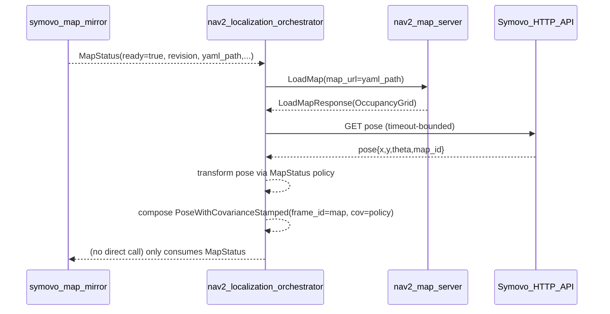

# SRS — `aehub_nav2_localization_orchestrator` (Localization Bringup Orchestrator, ROS 2 Jazzy)

Status: **Normative (MUST/SHALL/SHOULD)**  
Layer: **Application Layer (Orchestrator)** (per `docs/SRS_GLOBAL_STACK.md`)  
Package: `src/aehub_nav2_localization_orchestrator/`

---

## 1. Scope

This SRS specifies the **contracts, invariants, and responsibility boundaries** for the module `aehub_nav2_localization_orchestrator`.

### 1.1 What this module does (normative)

`aehub_nav2_localization_orchestrator` MUST:

- Subscribe to `aehub_msgs/MapStatus` from `aehub_symovo_map_mirror`.
- When `MapStatus` indicates a **new map revision** and is `ready==true`, call the Nav2 map server reload interface:
  - `nav2_msgs/srv/LoadMap` on a configurable service name.
- After successful map load, publish a single `geometry_msgs/PoseWithCovarianceStamped` to bootstrap localization (AMCL) via configurable `initialpose_topic`.
- Publish health/diagnostics via `diagnostic_msgs/DiagnosticArray`.
- Be a `rclpy.lifecycle.LifecycleNode` and respect lifecycle state ownership rules.

### 1.2 What this module does NOT do (hard boundary)

`aehub_nav2_localization_orchestrator` MUST NOT:

- Implement navigation capability, accept navigation commands, or perform navigation orchestration.
- Publish `/cmd_vel` under any conditions.
- Own Nav2 lifecycle transitions (Lifecycle manager remains external; this node is a consumer of Nav2 map_server API only).
- Fetch, write, or validate map artifacts (that is owned by `aehub_symovo_map_mirror`).
- Implement TF logic beyond publishing `/initialpose` (no TF graph management).

---

## 2. Layer placement & responsibility boundary (Global SRS alignment)

Per `docs/SRS_GLOBAL_STACK.md`:

- This module is **Application Layer** for localization bringup: it performs deterministic orchestration for a single workflow:
  - map update event → load map → publish initial pose.
- It MUST NOT behave as a “manager” of neighboring layers (no lifecycle control, no “fixing” dependencies). It only calls its own downstream contracts.

---

## 3. External contracts

### 3.1 Input contract: MapStatus (from map mirror)

- Topic parameter: `map_status_topic` (default `infra/map/status`)
- Type: `aehub_msgs/msg/MapStatus`
- Required semantics:
  - If `ready==false`, this node MUST treat the system as not ready for localization bringup and MUST report health ERROR.
  - `yaml_path` MUST be treated as an **opaque artifact path** produced by map mirror.
  - Dedup key MUST be `(revision, yaml_path)` to avoid redundant map reloads.

### 3.2 Output contract: Initial pose

- Topic parameter: `initialpose_topic` (default `initialpose`)
- Type: `geometry_msgs/msg/PoseWithCovarianceStamped`
- Frame:
  - **INV-FRAME-01 (MUST)**: `header.frame_id` MUST be `"map"`.

Covariance policy:

- Parameters:
  - `initialpose_cov_xy` (default `0.25`)
  - `initialpose_cov_yaw` (default `0.0685`)
- **INV-COV-01 (MUST)**: covariance MUST be a 6×6 row-major array (length 36) and set:
  - \(cov[x,x] = initialpose\_cov\_xy\)
  - \(cov[y,y] = initialpose\_cov\_xy\)
  - \(cov[yaw,yaw] = initialpose\_cov\_yaw\)

### 3.3 Downstream contract: Nav2 map server reload

- Service parameter: `map_server_load_map_service` (default `map_server/load_map`)
- Type: `nav2_msgs/srv/LoadMap`
- Semantics:
  - Request `map_url` MUST be set to the `MapStatus.yaml_path`.
  - The call MUST be bounded by `load_map_timeout_sec`.
  - A successful load MUST yield a non-empty occupancy grid:
    - width > 0 and height > 0.

### 3.4 Symovo pose source (external dependency)

This node fetches robot pose from Symovo HTTP API to publish `/initialpose`.

- Parameters:
  - `symovo_endpoint`, `amr_id`, `tls_verify`
- The Symovo HTTP contract and fallbacks are defined by:
  - `aehub_symovo_map_mirror/symovo_api_client.py`

### 3.5 Observability contract (health)

- Topic: `health/nav2_localization_orchestrator`
- Type: `diagnostic_msgs/msg/DiagnosticArray`
- MUST report:
  - OK when last handled event completed successfully.
  - ERROR when any step fails (map not ready, load_map failure, pose fetch failure, publish failure).
  - Include keys:
    - `last_ok_age_sec`
    - `map_revision` (if known)
    - `map_yaml` (if known)

---

## 4. Hard invariants (MUST)

### 4.1 Ownership / authority

- **INV-OWN-LOC-01 (MUST NOT)**: this node MUST NOT publish `/cmd_vel`.
- **INV-OWN-LOC-02 (MUST NOT)**: this node MUST NOT change lifecycle states of Nav2 nodes (no lifecycle “managing”).
- **INV-OWN-LOC-03 (MUST)**: this node MUST treat Nav2 map_server as a downstream service boundary (LoadMap only).

### 4.2 Determinism / idempotency

- **INV-IDEM-LOC-01 (MUST)**: the node MUST be idempotent with respect to map updates:
  - multiple identical `MapStatus` snapshots MUST NOT re-trigger map reload or initialpose publish.
- **INV-IDEM-LOC-02 (MUST)**: for a new map revision, the sequence MUST be:
  1) LoadMap success
  2) Publish initialpose
  and MUST NOT publish initialpose if LoadMap failed.

### 4.3 Bounded blocking

- **INV-TIME-LOC-01 (MUST)**: `LoadMap` call MUST be bounded by `load_map_timeout_sec`.
- **INV-TIME-LOC-02 (MUST)**: Symovo pose fetch MUST be bounded by HTTP timeouts (owned by Symovo client).

### 4.4 Namespace hygiene

- **INV-NS-LOC-01 (MUST)**: all ROS names used by the node MUST be relative (no leading `/`) so that launches can run under `/robot/<id>/...`.

### 4.5 Lifecycle gating

- **INV-LC-LOC-01 (MUST)**: the node MUST execute the MapStatus→LoadMap→initialpose workflow **only** while in Lifecycle state ACTIVE.
  - In other states, it MUST ignore MapStatus messages and MUST NOT call LoadMap nor publish initialpose.

---

## 5. Parameters (normative)

This module MUST expose at least the following parameters (names and defaults are normative unless marked deployment-tuned).

### 5.1 Inputs

- `map_status_topic` (string, default `infra/map/status`): MapStatus subscription.

### 5.2 Symovo pose source

- `symovo_endpoint` (string, default `https://192.168.1.100`)
- `amr_id` (int, default `15`)
- `tls_verify` (bool, default `false`)

### 5.3 Nav2 map server reload

- `map_server_load_map_service` (string, default `map_server/load_map`)
- `load_map_timeout_sec` (float, default `5.0`, deployment-tuned)

### 5.4 Initial pose publish

- `initialpose_topic` (string, default `initialpose`)
- `initialpose_cov_xy` (float, default `0.25`)
- `initialpose_cov_yaw` (float, default `0.0685`)

---

## 6. Normative behavior (workflow)

### 6.1 Main event handling (MapStatus → LoadMap → initialpose)

On receiving `MapStatus`:

0. If node is not ACTIVE:
   - MUST ignore the message (no side effects) and return.
1. If `ready==false`:
   - Update health to ERROR with `msg.error` (or `map_not_ready`).
   - MUST NOT call LoadMap.
   - MUST NOT publish initialpose.
2. If `(revision, yaml_path)` equals the last successful processed key:
   - Publish health OK and return.
3. Otherwise:
   - Call `LoadMap(map_url=MapStatus.yaml_path)` with bounded timeout.
   - If LoadMap fails, report health ERROR and stop.
   - If LoadMap succeeds but returns empty grid, report health ERROR and stop.
   - Fetch Symovo pose and compute pose in Nav2 `map` frame using `MapStatus` geometry policy.
   - Publish `PoseWithCovarianceStamped` to `initialpose_topic`.
   - Record `(revision, yaml_path)` as last successful processed key and update health OK.

### 6.2 Sequence diagram

---

## 7. Testing & isolation requirements

### 7.1 Required unit tests (SHOULD)

This package SHOULD have isolated tests verifying:

- Dedup behavior (same `(revision, yaml_path)` does not re-trigger).
- Error paths:
  - MapStatus not ready
  - LoadMap timeout / service unavailable / empty map
  - Symovo pose failure
- Initialpose covariance contract and `frame_id=="map"`.

### 7.2 Recommended isolated integration test strategy (SHOULD)

To enable fully isolated tests (without Nav2), a test SHOULD:

- Start a local stub publisher of `MapStatus`.
- Start a local mock ROS service implementing `nav2_msgs/srv/LoadMap` and returning a non-empty occupancy grid.
- Start a local stub Symovo HTTP server for pose endpoints.
- Run the node and assert:
  - `LoadMap` is called once per new map revision,
  - `initialpose` is published only after successful LoadMap,
  - diagnostics reflect success/failure.

---

## 8. Compliance checklist (Definition of Done)

- LifecycleNode; no uncontrolled side effects in non-ACTIVE states.
- Only orchestrates localization bringup: MapStatus → LoadMap → initialpose.
- Idempotent dedup on `(revision, yaml_path)`.
- Bounded timeouts on downstream calls.
- Diagnostics are meaningful and show last successful map revision.

