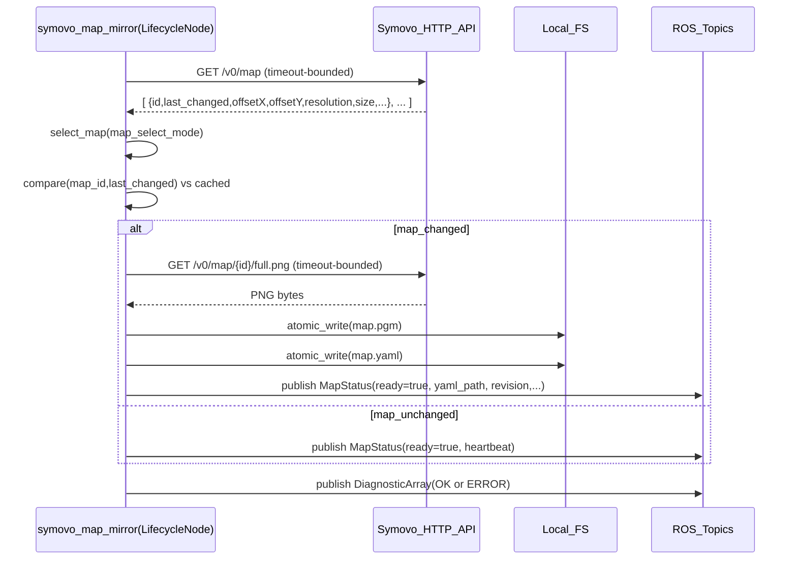

# SRS — `aehub_symovo_map_mirror` (Symovo Map Mirror, ROS 2 Jazzy)

Status: **Normative (MUST/SHALL/SHOULD)**  
Layer: **ROS Interface Layer** (per `docs/SRS_GLOBAL_STACK.md`)  
Package: `src/aehub_symovo_map_mirror/`

---

## 1. Scope

This SRS specifies the **contracts, invariants, and responsibility boundaries** for the module `aehub_symovo_map_mirror`.

### 1.1 What this module does (normative)

`aehub_symovo_map_mirror` MUST:

- **Fetch Symovo map snapshots** from Symovo HTTP API.
- **Detect map changes** using Symovo-provided revision marker (`last_changed`) and **polling**.
- **Materialize Nav2-compatible map artifacts** as an atomic pair:
  - `map.pgm` (binary PGM, `P5`)
  - `map.yaml` (Nav2 `map_server` YAML format)
- **Publish a typed status** message `aehub_msgs/MapStatus` describing the current map revision and artifact location.
- **Publish health/diagnostics** via `diagnostic_msgs/DiagnosticArray`.

### 1.2 What this module does NOT do (hard boundary)

`aehub_symovo_map_mirror` MUST NOT:

- Manage Nav2 lifecycle or call Nav2 services (e.g., MUST NOT call `nav2_msgs/srv/LoadMap`).
- Publish `/initialpose` or perform localization/orchestration logic.
- Depend on TF, localization sources, Nav2 stack, MQTT, or any other nodes to function.
- Implement domain FSM, policies, or orchestration; it is a **thin edge/adapter**.

Non-goal: end-to-end localization bringup. That belongs to an Application layer node (e.g., `aehub_nav2_localization_orchestrator`) which consumes `MapStatus`.

---

## 2. Layer placement & responsibility boundary (Global SRS alignment)

Per `docs/SRS_GLOBAL_STACK.md`:

- This module is **ROS Interface Layer**: it bridges an external system (Symovo HTTP API + map image) to ROS artifacts and a typed status stream.
- It MUST satisfy the “thin ROS layer” invariant:
  - **No FSM**
  - **No business logic**
  - **No management of neighbor layers**

---

## 3. External contracts

### 3.1 Symovo HTTP contract (required endpoints)

This module MUST be compatible with deployments where identifiers are mixed:

- Map list `id` may be a string or int-like → publish as **string**.
- AMR pose `map_id` may be an integer reference.

The Symovo HTTP client contract used by this module is implemented in:
`src/aehub_symovo_map_mirror/src/aehub_symovo_map_mirror/symovo_api_client.py`.

Required endpoints:

- **Map list**: `GET /v0/map`
  - Response MUST be a JSON list of objects with at least:
    - `id`, `last_changed`, `offsetX`, `offsetY`, `resolution`, `size`.
- **Map image**: `GET /v0/map/{id}/full.png`
  - Response MUST be a PNG image suitable to convert into a grayscale occupancy map.
- **AMR pose** (for map selection when configured):
  - Preferred: `GET /v0/amr/{id}/pose`
  - Allowed fallbacks: `GET /v0/amr/{id}`, `GET /v0/agv/{id}`, `GET /v0/agv`

### 3.2 Runtime constraint: `wait_for_changes` is not supported (normative)

Empirical runtime contract (2026-01): `curl .../wait_for_changes?...` **hangs** in production deployments.

Therefore:

- **INV-SYMOVO-01 (MUST)**: `update_mode` MUST be `poll` in production.
- **INV-SYMOVO-02 (MUST NOT)**: the module MUST NOT implement “long poll” semantics and MUST NOT rely on `wait_for_changes` for correctness or liveness.
- **INV-SYMOVO-03 (MUST)**: all HTTP calls MUST be bounded by explicit timeouts; no unbounded blocking on external HTTP.

Note: A best-effort `wait_for_changes` helper may exist for manual probing, but it MUST be treated as **unsupported/experimental** and MUST NOT be enabled in production configurations.

### 3.3 Filesystem contract (map artifacts)

Artifacts directory:

- **Parameter**: `map_output_dir`
- **Default** (if empty): `/tmp/aehub_maps/<namespace>` where `<namespace>` is derived from ROS namespace (safe, no `/`).

Artifacts:

- `map.pgm`: binary PGM (`P5`) with:
  - width/height from Symovo map image
  - maxval `255`
  - payload is grayscale bytes
- `map.yaml`: Nav2 `map_server` YAML containing:
  - `image: map.pgm` (relative) OR absolute path if explicitly configured
  - `resolution: <float>`
  - `origin: [<x>, <y>, 0.0]`
  - `negate: 0`
  - `occupied_thresh: 0.65`
  - `free_thresh: 0.196`

Atomicity:

- **INV-FS-01 (MUST)**: `map.pgm` and `map.yaml` MUST be written atomically using a temp file + rename strategy.
- **INV-FS-02 (MUST)**: `MapStatus.ready==true` MUST only be published after the artifact pair is fully written and durable enough for immediate consumption.

### 3.4 ROS interface contract

#### 3.4.1 Published topics

- **Map status**
  - Topic parameter: `map_status_topic`
  - Default: `infra/map/status`
  - Type: `aehub_msgs/msg/MapStatus`
  - Contract source-of-truth: `src/aehub_msgs/msg/MapStatus.msg`

- **Health / Diagnostics**
  - Topic: `health/symovo_map_mirror`
  - Type: `diagnostic_msgs/msg/DiagnosticArray`

Namespace rules:

- **INV-NS-01 (MUST)**: all topic names used in code MUST be **relative** (no leading `/`), so that launch namespaces apply cleanly.

#### 3.4.2 Lifecycle contract

The node MUST be a `rclpy.lifecycle.LifecycleNode`.

- On `configure`:
  - MUST initialize HTTP client and publishers.
  - MUST NOT start periodic work.
- On `activate`:
  - MUST start periodic polling loop.
- On `deactivate/cleanup`:
  - MUST stop periodic work and release external resources.

Standalone behavior:

- A parameter `standalone_autostart` MAY exist to enable self-transition to `ACTIVE` **for isolated execution/testing**.
- **INV-LC-ISO-01 (SHOULD)**: production launches SHOULD manage lifecycle externally and keep `standalone_autostart=false`.

---

## 4. Hard invariants (MUST)

### 4.1 Isolation & dependencies

- **INV-ISO-01 (MUST)**: the module MUST operate with no other ROS nodes present. The only external dependency is Symovo HTTP endpoint reachability.
- **INV-ISO-02 (MUST)**: the module MUST NOT require Nav2, TF, localization, or map_server to be installed/running to produce artifacts and `MapStatus`.

### 4.2 Single outward domain stream

- **INV-IO-01 (MUST)**: `MapStatus` is the single typed outward domain stream for “map mirror” state (plus health/diagnostics).

### 4.3 Correctness of `MapStatus`

- **INV-STAT-01 (MUST)**: If `MapStatus.ready==true`, then:
  - `yaml_path` MUST exist
  - referenced `map.pgm` MUST exist
  - metadata fields MUST correspond to the artifacts produced (resolution, offsets, width/height, revision).
- **INV-STAT-02 (MUST)**: If any step fails, the node MUST publish:
  - `MapStatus.ready==false` and `error` populated
  - Diagnostic status ERROR with matching message

### 4.4 Bounded blocking

- **INV-TIME-01 (MUST)**: each polling tick MUST have bounded runtime, enforced by bounded HTTP timeouts and avoiding unbounded waits.

---

## 5. Parameters (normative)

This module MUST expose at least the following parameters (names are normative; defaults are normative unless explicitly marked “deployment-tuned”).

### 5.1 Connection / selection

- **`symovo_endpoint`** (string, default `https://192.168.1.100`): Symovo base URL (no trailing `/` required).
- **`amr_id`** (int, default `15`): AMR identifier used when selecting map by pose.
- **`tls_verify`** (bool, default `false`): verify TLS certificates.
- **`map_select_mode`** (string enum, default `pose_map_id`):
  - `pose_map_id`: attempt to map `pose.map_id` to an entry from `/v0/map` by comparing IDs robustly (string/int coercion), else fall back.
  - `first_enabled`: select first map where `enabled==true`.
  - `first`: select first map in list.

Selection invariant:

- **INV-SEL-01 (MUST)**: selection MUST be deterministic for a given `/v0/map` response + pose snapshot.

### 5.2 Change detection

- **`update_mode`** (string enum, default `poll`): `poll | wait_for_changes`
  - **Production constraint**: MUST be `poll` (see INV-SYMOVO-01).
- **`poll_period_sec`** (float, default `2.0`, deployment-tuned): minimum wall-time between polls.
- **`wait_timeout_sec`** (float, default `10.0`): only applicable to experimental modes; MUST NOT be relied upon for correctness.

### 5.3 Output

- **`map_output_dir`** (string, default empty): output directory for `map.pgm` and `map.yaml`.
  - If empty, MUST default to `/tmp/aehub_maps/<namespace>`.
- **`write_absolute_image_path`** (bool, default `false`):
  - If true, `map.yaml.image` MUST be an absolute path to `map.pgm`.
  - If false, `map.yaml.image` MUST be basename `map.pgm`.
- **`map_status_topic`** (string, default `infra/map/status`): topic name for `MapStatus`.

### 5.4 Geometry policy (explicit)

Geometry policy is intentionally explicit and parameterized to lock behavior to a tested runtime contract.

- **`origin_mode`** (string enum, default `origin_offsets`):
  - `origin_offsets` or `origin_neg_offsets`
- **`pose_transform_mode`** (string enum, default `pose_subtract_offsets_flip_y`):
  - `pose_identity`, `pose_subtract_offsets`, `pose_add_offsets`,
  - `pose_subtract_offsets_flip_y`, `pose_add_offsets_flip_y`

Note: pose transform is not applied by this module, but the selected mode MUST be published in `MapStatus` so that consumers can apply the same policy consistently.

### 5.5 Standalone lifecycle (isolation support)

- **`standalone_autostart`** (bool, default `false`): if true, node transitions itself to ACTIVE on startup (for isolation / tests).

---

## 6. Normative behavior (data flow)

### 6.1 Map refresh loop

Each tick in ACTIVE state MUST:

1. Fetch `GET /v0/map`
2. Select a map based on `map_select_mode`
3. Detect change by comparing `(map_id, last_changed)` against last active snapshot
4. If changed:
   - Download `GET /v0/map/{id}/full.png`
   - Convert to grayscale, write `map.pgm` + `map.yaml` atomically
   - Publish `MapStatus.ready=true`
5. If not changed:
   - Publish `MapStatus` as a heartbeat (ready=true) referencing the current artifact path
6. On any failure:
   - Publish `MapStatus.ready=false` with `error`
   - Publish diagnostics ERROR

### 6.2 Sequence diagram (polling-only)

---

## 7. Compatibility (Nav2 assumptions — minimal)

This module MUST produce artifacts consumable by `nav2_map_server` via `LoadMap`:

- PGM: `P5` binary, grayscale bytes
- YAML fields exactly as expected by Nav2 map server

Non-requirement:

- Nav2 does not need to be installed or running for this module to meet its contract.

---

## 8. Observability (diagnostics contract)

The diagnostics status SHOULD include:

- `map_id`, `revision`, `resolution`, `offsetX`, `offsetY` (when available)
- `last_ok_age_sec`
- `pose_transform_mode`, `origin_mode`

Severity:

- OK when last tick succeeded
- ERROR when a tick fails (HTTP, parsing, image conversion, filesystem write, etc.)

---

## 9. Security

- **TLS**:
  - `tls_verify=true` SHOULD be used in production deployments with valid certificates.
  - `tls_verify=false` MAY be used for lab/self-signed setups, but must be an explicit operator choice.
- **Credentials**:
  - The module MUST NOT store or manage credentials; it uses only the configured endpoint and TLS policy.

---

## 10. Testing in isolation (normative requirements + test plan)

### 10.1 Isolation requirements (MUST)

- **INV-TEST-ISO-01 (MUST)**: tests for this module MUST run without Nav2, TF, map_server, localization, or any other nodes.
- **INV-TEST-ISO-02 (MUST)**: tests MUST not require a real Symovo controller.

### 10.2 Unit tests (existing, required to keep)

Pure unit tests (no ROS) MUST cover:

- Symovo API parsing and fallbacks: `test/test_symovo_api_client_parsing.py`
- Geometry mode behavior: `test/test_symovo_map_geometry.py`

### 10.3 Isolated integration test strategy (recommended)

An isolated integration test SHOULD be added that:

- Starts a local stub HTTP server in-process providing:
  - `GET /v0/map` returning a deterministic map entry with `last_changed`
  - `GET /v0/map/{id}/full.png` returning a small valid grayscale PNG (e.g., 10×10)
- Runs `symovo_map_mirror` with:
  - `standalone_autostart=true`
  - `symovo_endpoint=http://127.0.0.1:<port>`
  - `map_output_dir=<tmpdir>`
  - `update_mode=poll`
- Asserts:
  - `map.yaml` and `map.pgm` exist and are consistent
  - a `MapStatus` with `ready=true` was published and contains correct metadata and paths

The test MUST terminate deterministically and MUST NOT rely on long-poll or `wait_for_changes`.

---

## 11. Compliance checklist (Definition of Done for this module)

- Node is a LifecycleNode and respects lifecycle state boundaries.
- Polling-only change detection is enforced in production configs.
- Map artifacts are written atomically; `MapStatus.ready` truthfully reflects readiness.
- Runs and can be validated **standalone** with only Symovo (or a stub) reachable.

